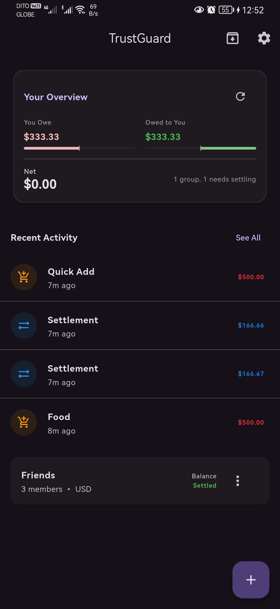
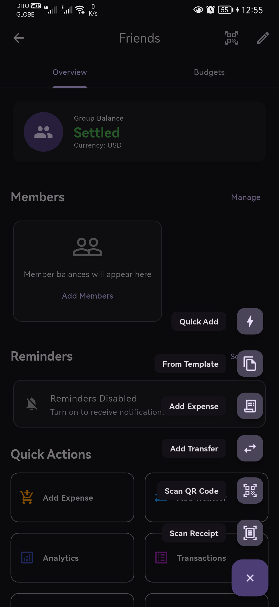

<p align="center">
  
</p>

<h1 align="center">TrustGuard</h1>

<p align="center">
  <strong>Offline-first group expense and settlement ledger</strong>
</p>

<p align="center">
  <a href="https://flutter.dev">
    
  </a>
  <a href="https://dart.dev">
    
  </a>
  <a href="LICENSE">
    
  </a>
</p>

<p align="center">
  <a href="#">
    
  </a>
  <a href="#">
    
  </a>
  <a href="#">
    
  </a>
  <a href="#">
    
  </a>
</p>

<p align="center">
  Track shared expenses, manage group balances, and settle debts efficiently among friends — all without an internet connection.
</p>

---

## 📱 Platform Support

TrustGuard is built with Flutter and runs on multiple platforms. Core functionality works everywhere, while some features require platform-specific capabilities:

| Feature | Android | iOS | macOS | Windows | Linux | Web |
|---------|:-------:|:---:|:-----:|:-------:|:-----:|:---:|
| **Core Features** | ✅ | ✅ | ✅ | ✅ | ✅ | ✅ |
| Expense & Group Management | ✅ | ✅ | ✅ | ✅ | ✅ | ✅ |
| Offline Database | ✅ | ✅ | ✅ | ✅ | ✅ | ⚠️ |
| Export & Backup | ✅ | ✅ | ✅ | ✅ | ✅ | ❌ |
| **Mobile Features** | | | | | | |
| QR Code Scanning | ✅ | ✅ | ❌ | ❌ | ❌ | ❌ |
| Receipt OCR | ✅ | ✅ | ❌ | ❌ | ❌ | ❌ |
| Home Screen Widgets | ✅ | ✅ | ❌ | ❌ | ❌ | ❌ |
| Local Notifications | ✅ | ✅ | ⚠️ | ⚠️ | ⚠️ | ❌ |
| Biometric Auth | ✅ | ✅ | ✅ | ✅ | ❌ | ❌ |

✅ Full support | ⚠️ Limited support | ❌ Not available

> **Note**: Mobile-only features gracefully degrade on unsupported platforms — they show appropriate messages rather than crashing.

---

## 📱 Screenshots

<p align="center">
  
  &nbsp;&nbsp;&nbsp;
  
</p>

---

## ✨ Features

### Core Functionality

| Feature | Description |
|---------|-------------|
| 🔒 **Offline-First** | All data stored locally using SQLite (Drift). No cloud account needed. |
| 📊 **Dashboard** | Global balance overview with animated rolling numbers and recent activity. |
| 📈 **Spending Analytics** | Interactive pie charts and trend lines for spending by category and member. |
| 👥 **Group Management** | Create multiple groups for trips, roommates, or events. |
| 💰 **Flexible Expenses** | Split equally, by custom amounts, or percentage-based with tactile slider controls. |
| ⚡ **Efficient Settlements** | Deterministic greedy algorithm minimizes the number of transfers needed. |

### Productivity

| Feature | Description |
|---------|-------------|
| 📝 **Expense Templates** | Reusable templates for common expenses save time on data entry. |
| 💳 **Budget Tracking** | Set periodic budgets (weekly, monthly, yearly) with automated spending alerts. |
| 🔄 **Recurring Transactions** | Automate periodic expenses and transfers with flexible schedules. |
| 🏷️ **Tagging & Filtering** | Categorize transactions with tags and find them with search and filters. |
| 💡 **Smart Suggestions** | Intelligent amount suggestions based on your spending habits. |
| ⌨️ **Keyboard Shortcuts** | Full desktop support (Ctrl/Cmd + N/T/F/S/Esc). |

### Sharing & Import

| Feature | Description |
|---------|-------------|
| 📲 **QR Code Sharing** | Share expenses device-to-device without internet via compressed QR codes. *(Mobile only)* |
| 🧾 **Receipt OCR** | Extract amount, date, and merchant from receipts using on-device ML. *(Mobile only)* |
| 📥 **Data Import** | Migrate from Splitwise or Tricount via CSV with intelligent member mapping. |
| 📤 **Export & Backup** | Export data to CSV or create full JSON backups. |

### Personalization & UX

| Feature | Description |
|---------|-------------|
| 🎨 **Theme Customization** | Light, Dark, System, and High-Contrast modes. |
| 👤 **Member Avatars** | Custom photos, camera captures, or preset color initials. |
| 📱 **Home Screen Widgets** | View balances at a glance. *(Android & iOS only)* |
| ✨ **Motion Design** | Container transforms, staggered animations, and celebration effects. |
| 🎯 **Speed Dial FAB** | Quick access to common actions with Quick Add sheet. |
| 📊 **Balance Visualization** | Bidirectional progress bars for clear balance representation. |
| ↩️ **Undo Safety** | 5-second undo window for accidental deletions. |

### Accessibility & Security

| Feature | Description |
|---------|-------------|
| ♿ **Accessibility Compliance** | Screen reader support (TalkBack/VoiceOver), logical focus order, 48dp touch targets. |
| 🔐 **Security** | PIN or biometric lock to protect your data. |
| 🛡️ **Privacy Focused** | Your financial data never leaves your device. |

---

## 🚀 Getting Started

### Prerequisites

- [Flutter SDK](https://flutter.dev/docs/get-started/install) (Stable channel, 3.9+)
- **Android**: Android SDK
- **iOS/macOS**: Xcode (macOS only)
- **Windows**: Visual Studio with C++ development tools
- **Linux**: GTK development libraries (`libgtk-3-dev`, `libblkid-dev`, `liblzma-dev`)

### Installation

1. **Clone the repository**
   ```bash
   git clone https://github.com/MasuRii/TrustGuard.git
   ```

2. **Navigate to the app directory**
   ```bash
   cd TrustGuard/app
   ```

3. **Install dependencies**
   ```bash
   flutter pub get
   ```

4. **Run code generation**
   ```bash
   dart run build_runner build --delete-conflicting-outputs
   ```

5. **Run the app**
   ```bash
   flutter run
   ```


## 🌍 Localization

TrustGuard is ready for internationalization! If you'd like to see the app in your language, check the [Adding Translations](CONTRIBUTING.md#adding-translations) section in our contributing guide.

---

## 🤝 Contributing

Contributions are welcome! Please read our [Contributing Guidelines](CONTRIBUTING.md) before submitting a Pull Request.

1. Fork the repository
2. Create your feature branch (`git checkout -b feature/amazing-feature`)
3. Commit your changes (`git commit -m 'Add some amazing feature'`)
4. Push to the branch (`git push origin feature/amazing-feature`)
5. Open a Pull Request

---

## 📄 License

This project is licensed under the MIT License — see the [LICENSE](LICENSE) file for details.

---

<p align="center">
  Made with ❤️ using Flutter
</p>

<p align="center">
  <a href="https://github.com/MasuRii/TrustGuard/stargazers">
    
  </a>
  <a href="https://github.com/MasuRii/TrustGuard/network/members">
    
  </a>
</p>
